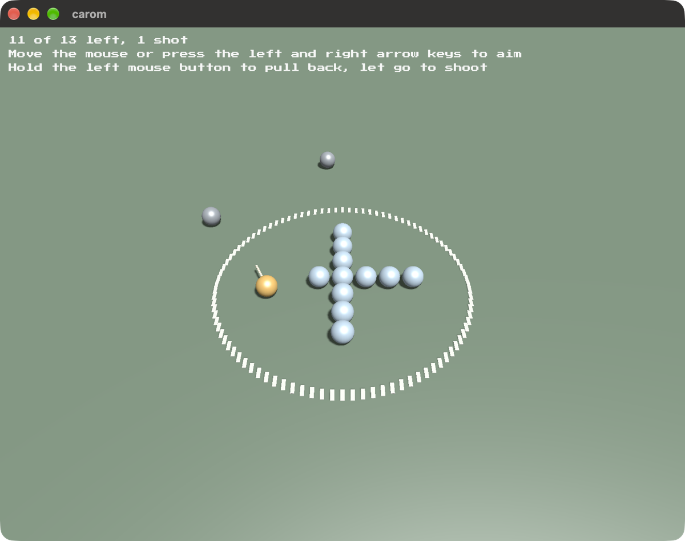

# carom

Shoot at thirteen marbles with _your_ marble. It's basically shooting marbles. Just on a computer.



Built on [blitzkit](https://github.com/jvalol/blitzkit), the ninth game on that
engine. It's the first where one body with rotation, friction, momentum, etc. meets another.

Why carom? I didn't know either, but learning is part of the joy. Carom means to rebound or ricochet off a surface after hitting it. It can mean a glancing collision—“the ball caromed off the wall.”

```
cargo run
```

---

I asked AI to draft this for me. I've edited it. Any surviving AI smells are my oversight.
